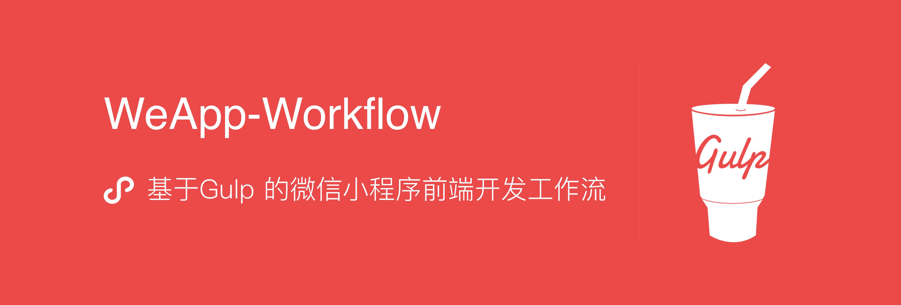
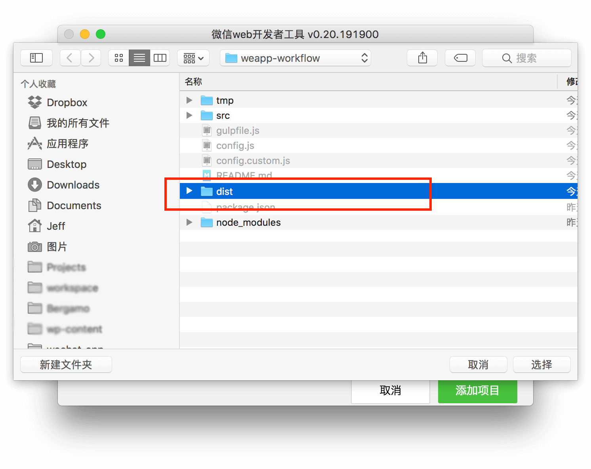
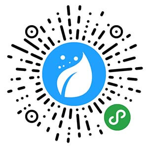

> [WeApp-Workflow](https://github.com/Jeff2Ma/WeApp-Workflow)：基于Gulp 的微信小程序前端开发工作流

## 介绍

[](https://greenkeeper.io/)

WeApp-Workflow 是一个专门为开发微信小程序打造的前端开发工作流，基于Gulp 4 开发，旨在通过工作流的方式解决微信小程序开发过程中写前端代码的痛点。

项目主页：[https://github.com/Jeff2Ma/WeApp-Workflow](https://github.com/Jeff2Ma/WeApp-Workflow)

文章介绍：[https://devework.com/weapp-workflow.html](https://devework.com/weapp-workflow.html)

## 功能

### SCSS 实时编译为 WXSS

使用Sass 预处理器，让写CSS 更加顺畅。`.scss`文件会实时编译为微信小程序支持的`.wxss`文件。

### WXSS(CSS) 中px 单位转小程序单位rpx

以官方推荐的iPhone 6 为标准设计格式，开发中直接写`px` 即可自动转换为`rpx`。

```css
// Input: src/pages/index/index.scss
.index__header {
	font-size: 14px;
	margin-top: 20PX; /* 如果为大写的`PX`单位则不会转换 */
}

// Output: dist/pages/index/index.wxss
.index__header {
	font-size: 28rpx;
	margin-top: 20PX; /* 如果为大写的`PX`单位则不会转换 */
}

```

### 图片压缩

实时压缩图片并采用增量方式防止被重复压缩。

### 自动上传图片到CDN 并更新路径为https 绝对路径

小程序不支持相对路径的图片引用，仅支持带`https`协议头的绝对路径。本工作流可以将WXML 以及WXSS 文件中引用的相对路径图片上传到云存储CDN 或通过FTP/SFTP 协议上传到个人服务器空间。目前支持腾讯云，七牛云。

```html
// Input: src/pages/index/index.wxml
<image src="%ASSETS_IMG%/t.png"></image>

// Output: dist/pages/index/index.wxml
<image src="https://cdn.devework.com/weapp/devework/t.png"></image>
```

### Font 文件转为base64 编码

小程序不支持相对路径的字体文件，本工作流可将CSS 中引用到的Font 文件转码为base64 并替换原路径。

```
// Input: src/pages/index/index.scss
@font-face {
  font-family: 'fontello';
  src: url("assets/fonts/fontello.ttf") format('truetype');
}

// Output: dist/pages/index/index.wxss
@font-face {
  font-family: 'fontello';
  src: url(data:application/font-sfnt;charset=utf-8;base64,AAEAAAAPAIAA....FsASNsQIARAAA) format("truetype");
}

```
### 全自动构建雪碧图及生成相应CSS

本功能由[postcss-lazysprite](https://github.com/Jeff2Ma/postcss-lazysprite) 插件驱动。开发中准备好图片后仅仅写一句类似`@lazysprite "xxxx"`的代码，即可全自动构建雪碧图及生成相应CSS。

```css
// Input: src/app.scss
@lazysprite "filetype";

// Output: dist/app.wxss
.icon-filetype-doc {
    background-image: url(../sprites/filetype.png);
    background-position: 0 0;
    width: 80px;
    height: 80px;
}

.icon-filetype-pdf {
    background-image: url(../sprites/filetype.png);
    background-position: -90px 0;
    width: 80px;
    height: 80px;
}

@media only screen and (-webkit-min-device-pixel-ratio: 2), only screen and (min-device-pixel-ratio:2) {
    .icon-filetype-doc {
        background-image: url(../sprites/filetype@2x.png);
        background-position: 0 0;
        background-size: 170px 170px;
    }

    .icon-filetype-pdf {
        background-image: url(../sprites/filetype@2x.png);
        background-position: -90px 0;
        background-size: 170px 170px;
    }
}
```

## 亮点

### Gulp4

采用最新的Gulp 4版本的新特征，让工作流运行更快。

### 简洁不简单

核心只有一个默认任务，通过合理的任务搭配机制减少繁琐流程及来回运行终端，让开发更便捷。

### 增量更新机制，运行起来更快

引入Sass 的增量编译以及图片相关任务的增量更新机制，让工作流运行速度更快。

## 项目结构

```
.
├── config.custom.js // gulp自定义配置，会覆盖config.js
├── config.js // gulp 配置文件
├── gulpfile.js
├── package.json
├── src // 开发目录
│   ├── app.js
│   ├── app.json
│   ├── app.scss
│   ├── assets // 开发相关的静态文件原始资源
│   │   ├── fonts //字体文件
│   │   ├── images // 图片文件，可被上传到CDN
│   │   ├── scss // 一般放置SCSS 的minxins 等被import 的SCSS 文件
│   │   └── sprites // 生成雪碧图小图的目录
│   ├── image // 小程序专用的图片资源（如tabbar icon）目录
│   ├── pages
│   └── utils
├── tmp //  通过src 目录编译后生成的缓存目录
└── dist // 通过src 目录编译后生成的文件目录，也是小程序开发的项目目录

```

## 开始使用

> Node 版本建议在v4 以上。因为该工作流涉及到第三方依赖，建议在科学上网的环境下操作。

### 安装

0、请先全局按照 Gulp-cli

```
npm install gulp-cli -g
```

1、通过`git clone`下载项目文件。

```
git clone https://github.com/Jeff2Ma/WeApp-Workflow
```
2、建议删除`.git`目录（Windows 用户请手动删除）

```
cd WeApp-Workflow
rm -rf .git
```

3、安装必要模块

```
npm i
```

4、启动开发

建议复制`config.js`并重命名为`config.custom.js`，然后根据个人实际需求改写相关配置信息（每个配置项均有注释说明）。接下来在终端中运行如下命令开启：

```
gulp
```


其余任务：`gulp clean`：清除`dist`，`tmp`文件夹。

### 配置

完成以上操作后，需要在“微信web 开发者工具”也进行相关设置（以 v1.x 为准，不再兼容 v0.x 版）。

1、新建项目，直接选择整个项目目录，即`project.config.json` 所在的目录作为项目目录。

<p align="center">

</p>

### 开发

接下来进入常规开发即可。开发过程中，**使用第三方编辑器（WebStorm、Sublime Text 等）编辑`src`目录下的文件**，保存修改后gulp 进程会实时编译到`dist`目录相应的位置。而**微信web 开发者工具会自动编译刷新，此时仅充当预览功能**。

开发要点说明：

- **SCSS 开发**：直接在`src/pages/page-name`下进行编辑`page-name.scss`，会自动转化为`page-name.wxss` 并放置到`dist`目录相应位置。开发过程中涉及到数值的地方直接写`px`单位（按iPhone6 为标准设计稿），会自动计算转化为`rpx`单位。如果特殊情况不想转化，请写大写的`PX`。

- **WXML开发**：除**CDN 图片**功能需要特殊写图片路径外，其它无特殊要求。

- **WebFont**：先在fontell.com 这类网站制作好雪碧图然后拿到ttf 格式的文件到`src/assets/fonts`下，常规方式引用即可自动base64 转码。

- **CDN 图片**：（该功能默认关闭，需自行在设置项开启）微信小程序中wxss 或wxml 不支持相对路径的图片，需要https 开头的绝对路径。本工作流可以使得开发时候直接写相对路径，工作流会帮忙上传到CDN 并替换原路径。此类图片必须放置到`src/assets/images`下，然后在wxml 或CSS 中用`%ASSETS_IMG%/filename.png`的方式写路径。`%ASSETS_IMG%`为自定义的目录供后续字符串替换。

- **雪碧图**：首先在小程序中不建议用雪碧图，直接用单图或者WebFont 的形式更好。如果一定要用，按照代码中的小程序示例放置**小图目录**到`src/assets/sprites`下然后在SCSS 中通过`@lazysprite "xxxx"`调用即可（建议调用代码放到`app.scss`下）。雪碧图高级用法请[点击这里](https://github.com/Jeff2Ma/postcss-lazysprite)。

## Q&A

- Q：为什么工作流中没有AutoPrefixer 的功能？

	A：因为微信开发者工具的“项目”中“样式补全”选项已经提供了这个功能；

- Q：为什么工作流中没有配置bable 的ES6 转ES5 的功能？

	A：如上，微信开发者工具已经提供。

- Q：跟[WePY](https://github.com/wepyjs/wepy) 这类小程序开发框架相比优势在哪？

	A：微信支付团队开发的WePY 确实是一个不错的工具。如果跟WePY 放到同一水平线对比，WeApp-Workflow 根本没有优势。WeApp-Workflow 是一个workflow 工具，不是一个开发框架，其侧重的是小程序中CSS 层面的开发，对于一部分开发者来说，他/她的小程序并不需要WePY 那么重的开发框架。

- Q：WeApp-Workflow 没有相应专门的编译任务（类似`gulp build`,`npm run build`这种）？

	A：是的，因为WeApp-Workflow 是适合用来开发“小”的小程序而非复杂的小程序，所以综合考虑开发速度、代码量等方面，没有专门的开发阶段一个任务(dev)，开发完成阶段额外一个编译任务(buid)。直接一个任务就行。

## 案例展示

这些小程序采用 WeApp-Workflow 作为开发工作流（欢迎发PR 添加案例）：



## 鸣谢

[tmt-workflow](https://github.com/Tencent/tmt-workflow)

[QMUI_Web](https://github.com/QMUI/QMUI_Web)

[postcss-lazysprite](https://github.com/Jeff2Ma/postcss-lazysprite)

[gulp-qcloud-upload](https://github.com/Jeff2Ma/gulp-qcloud-upload)


## TODO

- [ ] 增加单元测试

- [ ] ES6 Rewrite

- [ ] 上传到FTP/SFTP 服务器功能

- [ ] 支持七牛云存储的CDN

## 意见反馈

如果有意见反馈或者功能建议，欢迎创建 Issue 或发送 Pull Request，感谢你的支持和贡献。
