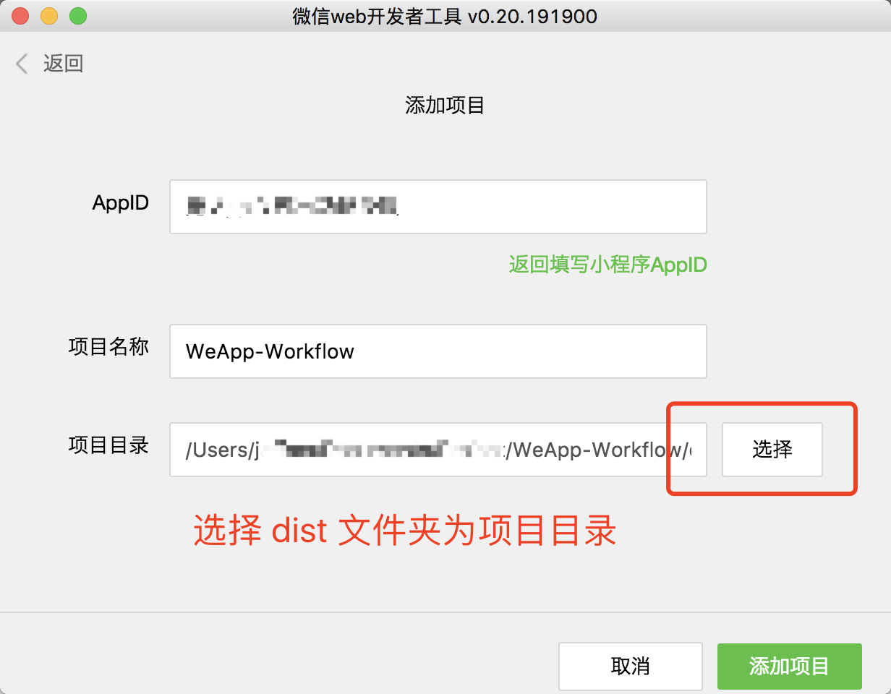
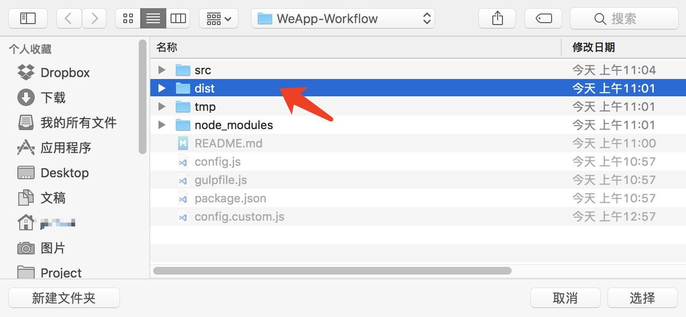
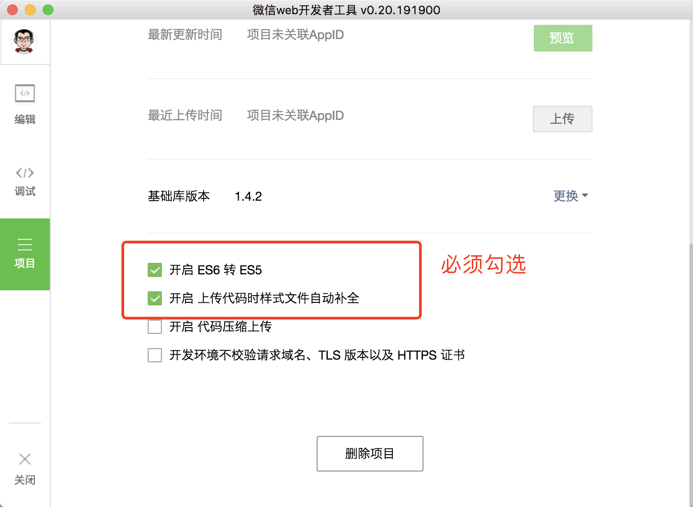
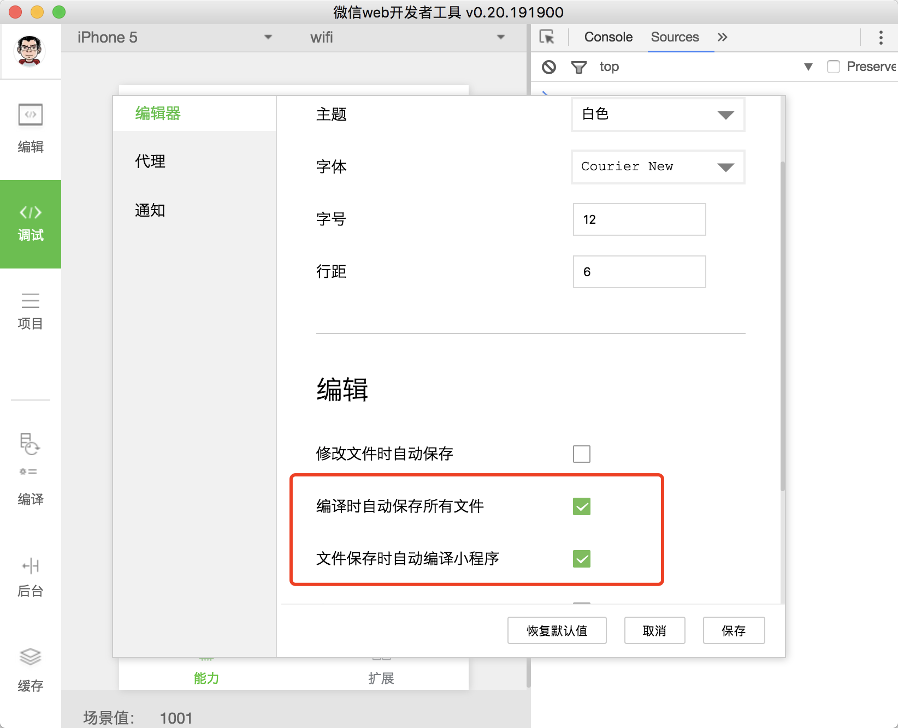

# WeApp-Workflow

> 基于Gulp 的微信小程序前端开发工作流

## 介绍

WeApp-Workflow 是一个专门为开发微信小程序打造的前端开发工作流，基于Gulp 4 开发，旨在通过工作流的方式解决微信小程序开发过程中写前端代码的痛点。

## 开发详解

### SCSS 实时编译为 WXSS

使用Sass 预处理器，让写CSS 更加顺畅。`.scss`文件会实时编译为微信小程序支持的`.wxss`文件。

### WXSS(CSS) 中px 单位转小程序单位rpx

以官方推荐的iPhone 6 为标准设计格式，开发中直接写`px` 即可自动转换为`rpx`。

```css
// Input: src/pages/index/index.scss
.index__header {
	font-size: 14px;
	margin-top: 20PX; /* 如果为大写的`PX`单位则不会转换 */
}

// Output: dist/pages/index/index.wxss
.index__header {
	font-size: 28rpx;
	margin-top: 40PX; /* 如果为大写的`PX`单位则不会转换 */
}

```

### 图片压缩

实时压缩图片并采用增量方式防止被重复压缩。

### 自动上传图片到CDN 并更新路径为https 绝对路径

小程序不支持相对路径的图片引用，仅支持带https 的绝对路径。本工作流可以将WXML 以及WXSS 文件中引用的相对路径图片上传到云存储的CDN或者自带服务器空间。目前支持腾讯云，七牛云。

```html
// Input: src/pages/index/index.wxml
<image src="../../assets/images/t.png"></image>

// Output: dist/pages/index/index.wxml
<image src="https://cdn.devework.com/weapp/devework/t.png"></image>
```

### 转化Font 文件为base64 编码

小程序不支持相对路径的字体文件，本功能可以将CSS 中的font 文件转码为base64 并替换原路径。

```
// Input: src/pages/index/index.scss
@font-face {
  font-family: 'fontello';
  src: url("assets/fonts/fontello.ttf") format('truetype');
}

// Output: dist/pages/index/index.wxss
@font-face {
  font-family: 'fontello';
  src: url(data:application/font-sfnt;charset=utf-8;base64,AAEAAAAPAIAA....FsASNsQIARAAA) format("truetype");
}

```
### 全自动构建雪碧图及生成相应CSS

本功能由[postcss-lazysprite](https://github.com/Jeff2Ma/postcss-lazysprite) 插件驱动。开发中准备好图片后仅仅写一句类似`@lazysprite "xxxx"`的代码，即可全自动构建雪碧图及生成相应CSS。

```css
// Input: src/app.scss
@lazysprite "filetype";

// Output: dist/app.wxss
.icon-filetype-doc {
    background-image: url(../sprites/filetype.png);
    background-position: 0 0;
    width: 80px;
    height: 80px;
}

.icon-filetype-pdf {
    background-image: url(../sprites/filetype.png);
    background-position: -90px 0;
    width: 80px;
    height: 80px;
}

@media only screen and (-webkit-min-device-pixel-ratio: 2), only screen and (min-device-pixel-ratio:2) {
    .icon-filetype-doc {
        background-image: url(../sprites/filetype@2x.png);
        background-position: 0 0;
        background-size: 170px 170px;
    }

    .icon-filetype-pdf {
        background-image: url(../sprites/filetype@2x.png);
        background-position: -90px 0;
        background-size: 170px 170px;
    }
}
```

## 特征

### Gulp4 + ES2015

采用最新的Gulp 4版本的新特征，并用ES2015 的写法，让工作流运行更快。

### 简洁不简单

核心只有一个默认任务，通过合理的任务搭配机制减少繁琐流程及来回运行终端，让开发更简单。

### 增量更新机制，运行起来更快

引入Sass 的增量编译以及图片相关任务的增量更新机制，让工作流运行速度更快。

## 项目结构

```
.
├── config.custom.js // gulp自定义配置，会覆盖config.js
├── config.js // gulp 配置文件
├── gulpfile.js
├── package.json
├── src // 开发目录
│   ├── app.js
│   ├── app.json
│   ├── app.scss
│   ├── assets // 开发相关的静态文件原始资源
│   │   ├── fonts //字体文件
│   │   ├── images // 图片文件，可被上传到CDN
│   │   ├── scss // 一般复制scss 的minxins 等被import 的scss 文件
│   │   └── sprites // 生成雪碧图小图的目录
│   ├── image // 小程序专用的图片资源（如tabbar icon）目录
│   ├── pages
│   └── utils
├── tmp //  通过src 目录编译后生成的缓存目录
└── dist // 通过src 目录编译后生成的文件目录，也是小程序开发的项目目录

```

## 开始使用

> 因为该工作流涉及到第三方依赖，建议在科学上网的环境下操作。

### 安装

1、首先通过`git clone`下载项目文件。

```
git clone https://github.com/Jeff2Ma/WeApp-Workflow
```
2、建议删除`.git`目录

```
cd WeApp-Workflow
rm -rf .git
```

3、安装必要模块

```
npm i
```
4、启动开发

```
gulp
```

### 配置

完成以上操作后，需要在“微信web 开发者工具”也进行相关设置。

1、新建项目，记住选择`dist`文件夹作为项目目录。




2、建立并进入项目后，勾选如下两个选项（“ES6 转 ES5”、“样式补全”）。后两个选项视实际情况选择。



同时菜单项进入设置，勾选如下两个选项：



接下来进入常规开发即可。开发过程中，**使用第三方编辑器（WebStorm、Sublime Text 等）编辑`src`目录下的文件**，保存修改后gulp 进程会实时编译到`dist`目录相应的位置。而**“微信web 开发者工具”仅充当预览功能**。


## Q&A

- Q：为什么工作流中没有AutoPrefixer 的功能？

	A：因为微信开发者工具的“项目”中“样式补全”选项已经提供了这个功能；

- Q：为什么工作流中配置bable 的ES6 转ES5 的功能？

	A：如上，微信开发者工具已经提供。
	
## 案例展示

这些小程序采用 WeApp-Workflow 作为开发工作流：


	
## TODO

- [ ] 上传到FTP/SFTP 服务器功能

- [ ] 支持七牛云存储的CDN